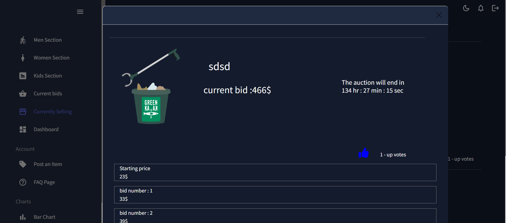

# Auction.co.il 

auction.co.il is an auction platform that connects sellers and buyers
(contact info sent to both seller and winning bidder via email).
On this platform, you can also see relevant statistics such as projected revenue,
money spent on items, and the number of items sold and bought.

## Table Of Contents
- [Auction.co.il](#Auction.co.il)
  * [Running the project](#running-the-project)
  * [Screenshots](#screenshots)
    + [auction section](#auction section)
    + [personal statistics](#personal statistics)
  * [Technologies](#technologies)
    + [Client-Side](#client-side)
    + [Server-Side](#server-side)
  * [Whats Next](#whats-next)
 
  
## Running the project

1. Clone the repo.
2. Run `npm install`.
3. enter the server folder.
4. run `nodemon server.js`.
5. go back to the root folder.
6. Run `npm start`.
7. Navigate to `http://localhost:3000`.

## Screenshots

### auction section
currently selling items

### personal statistics
DashBoard

## Technologies:

### Client-side:
* React.JS
* mui

### Server-side:
* Node.JS
* Express
* mongoDB

## What's next:
1. Move end of auction handling to server-side .
2. Add more sections and sub sections.
3. add more parameters for recommendation. 
3. Adding affiliation to the app (because why not :))
4. Buy clothes the way its meant to be. 

